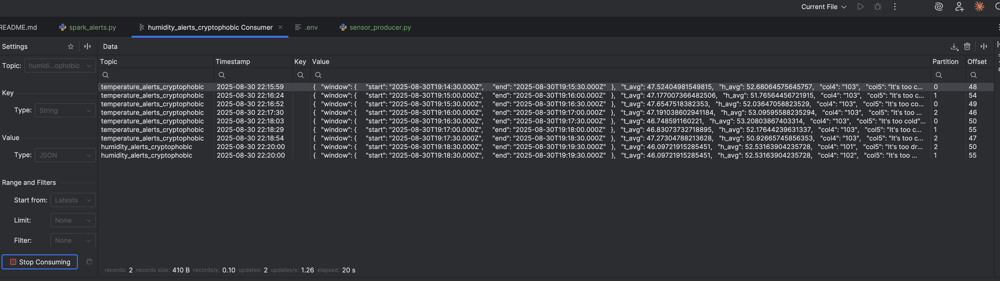

# Домашнє завдання до теми «Spark streaming»

Висновок. Зібрано end-to-end пайплайн моніторингу IoT: Kafka -> Spark Structured Streaming -> Kafka. 

 - дані з топіка building_sensors_cryptophobic агрегуються ковзним вікном 1 хв (slide 30 с, watermark 10 с), 
 - середні temperature_avg і humidity_avg звіряються з порогами з alerts_conditions.csv (-999 = ігнор). 
 - алерти пишуться динамічно у два топіки: temperature_alerts_cryptophobic та humidity_alerts_cryptophobic (колонка topic). 
 - доступ до брокера — через SASL/PLAIN. По дорозі виправлено: сумісність версій конектора, заборону union двох стрім-агрегацій (перехід на “long/explode”), та парсинг мікросекундних таймштампів. 
 - Роботу перевірено через console sink, тестовий продюсер і JetBrains Kafka-плагін - повідомлення в обох alert-топіках надходять.

Скріншот для додатку:

